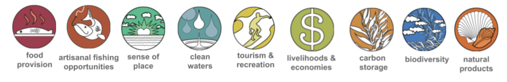

<style>
  .col2 {
    columns: 2 200px;
    -webkit-columns: 2 200px; /* chrome, safari */
    -moz-columns: 2 200px;   /* firefox */
  }
</style>

---

The Ocean Health Index measures the ability of oceans to sustainably provide products or services (called “goals”) that are important to humans. The Baltic's Ocean Health Index assessments score 9 goals, some of which have sub-goals. Here you will find a description of the goals used in global assessments.

<div style="width: 100%;">

<p>

Goal-by-goal, you can explore the data used to model status and trend, as well as the pressures and resilience measures contributing to goal scores.

Goal scores are calculated by modeling data first as Present Status and Likely Future State. Likely Future State is a combination of status, trend, pressures and resilience calculations, which unequally contribute to goal scores.

Scroll down for a description of each goal as well as the model and data used to calculate the goal (blue text links to descriptions of the specific data used in the calculation of each goal).

A complete list of the data used in the calculations is [available](http://ohi-science.org/bhi/layers.html), and complete methods are also available. You can also explore [OHI+ goal approaches](https://ohi-science.org/projects/ohi-plus/).
</p>
</div>

<div style="clear:both;"></div>

<br>



---

```{r, child = "local_goals.Rmd"}

```

